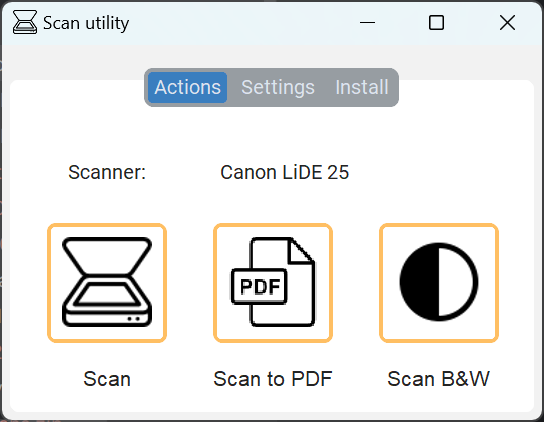

# Revive your old Canon LiDE 25 scanner!

This application is a modern frontend UI to the old Canon interface for the [Canon LiDE 25](https://fr.canon.be/support/consumer/products/scanners/canoscan/lide-series/canoscan-lide-25.html?type=firmware), an ancient flatbed scanner, that I bought ahem... a long time ago and that is officially not supported on Windows 11.

Good news it's possible to make it work! However he original UI is quite outdated and I wanted to make something a little nicer.

Currently only the Scan feature works but I plan to implement the other 2 options.

# Screenshot

# Uses

* [pytwain](https://pytwain.readthedocs.io/en/latest/index.html)
* [customTkInter](https://github.com/TomSchimansky/CustomTkinter)

# Source

* https://github.com/denisenkom/pytwain?tab=readme-ov-file
* https://www.germain.lol/2020-jinstalle-un-scanner-canon-lide-25-de-2005-sur-windows-10/

# Setup

For 32 bit (the only way it worked for my scanner):

* Install latest Python 32 bit version: https://www.python.org/downloads/release/python-3122/
* Get the latest twain-dsm version: https://github.com/twain/twain-dsm/tree/master/Releases/dsm_020403
* Read this: https://github.com/twain/twain-dsm/tree/master/TWAIN_DSM and put the the 32 bit DLL from the repo in `C:\Windows\System32\twain_32`